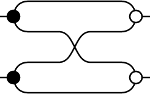

# Graphical Linear Algebra Layout

An algorithm and demo for laying out
[graphical linear algebra](https://graphicallinearalgebra.net/)
string diagrams in the browser using the
[miso framework](https://github.com/dmjio/miso).

# Example Images

Right-hand side of [rule "B1"](https://graphicallinearalgebra.net/2015/05/16/natural-numbers-diagrammatically/)

Left-hand-side of [rule "Assoc"](https://graphicallinearalgebra.net/2015/05/16/natural-numbers-diagrammatically/)

Natural number "3" as a diagram

# Building & running the demo

Build with [nix](https://nixos.org/nix/):

    nix-build

View the demo by serving it. For example with warp:

    warp -d result/bin/gla-layout.jsexe

# TODO

- [ ] Basic layout
  - [x] Static image
  - [x] One stack of diagrams
  - [x] List of stacks
  - [x] Connections between stacks
- [ ] Interactivity
  - [ ] Specify diagrams as JSON
  - [ ] Add/Remove generators from a diagram
- [ ] More complex diagrams
  - [ ] Syntactic sugars

# Code Cleanup

- [ ] stop using gross string concatenation in drawConnector. Nasty!
- [ ] Replace Coords with a 2D vector library?
